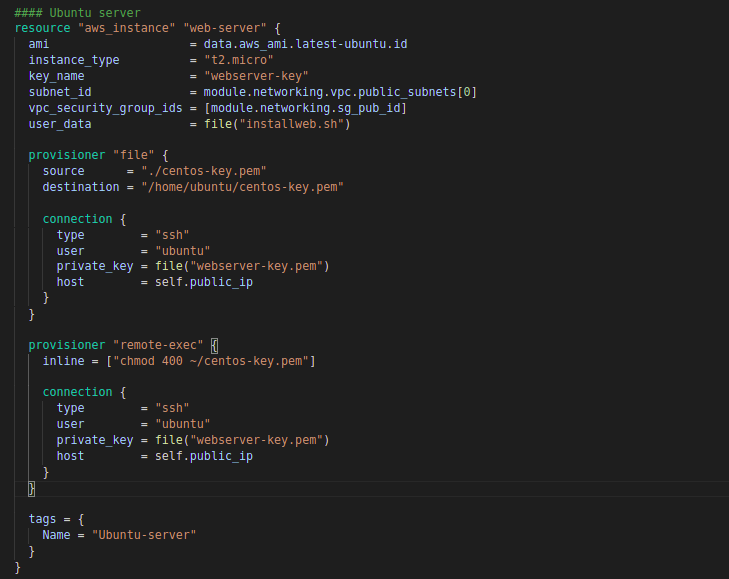

My Exadel Task 3 project (Terraform/IaC introduction)
======================================================

Important moments:
------------------
1. Read about IaC (Infrastructure as a Сode). *Answer: I have read about IaC [here](https://docs.microsoft.com/en-us/devops/deliver/what-is-infrastructure-as-code), [here](https://www.redhat.com/en/topics/automation/what-is-infrastructure-as-code-iac) and [here](https://spacelift.io/blog/infrastructure-as-code)*
2. All steps are done using Terraform , if you need any other tools besides WEB GUI, you can use them. *Answer: I used [Terrafrom](https://learn.hashicorp.com/tutorials/terraform/aws-build?in=terraform/aws-get-started) (Terraform CLI, AWS CLI) for solving tasks (installed it to my local PC)*
3. You should not use the previously created VPC/EC2, etc. We assume that the task is executed from a “clear” AWS account with only the IAM administrator role. *I used clear AWS account*
4. Passwords/Keys should not be stored on GitHub. *Answer: I added it to gitignore file*

Mandatory tasks
---------------

1. Create EC2 Instance t2.micro
   - Ubuntu
   - CentOS

   Both instances must have a tag with names.
   *Answer: Firstly, I created new AWS profile on my local PC with Access Key ID and Secret Access Key which given when I created user in AWS.   Then, I created new VPC on networking module.  Then, I created 
   two AWS security groups (see step 2). Then, I created two EC2 Instance t2.micro. Ubuntu on public subnet with [installweb.sh](./terraform/installweb.sh):  CentOS on private subnet: *
2. EC2 Ubuntu must have Internet access, there must be incoming access: ICMP, TCP/22, 80, 443, and any outgoing access. *Answer: Public: allowed SSH, HTTP, HTTPS, ICMP inbound traffic over interet:*
3. EC2 CentOS should not have access to the Internet, but must have outgoing and incoming access: ICMP, TCP/22, TCP/80, TCP/443 only on the local network where EC2 Ubuntu, EC2 CentOS is located. *Answer: Private: allowed SSH, HTTP, HTTPS, ICMP inbound traffic over private network (see step 7 also)
: *
4. On EC2 Ubuntu, install a web server (nginx/apache);
   - Create a web page with the text “Hello World” and information about the current version of the operating system. This page must be visible from the Internet. *Answer: I created [installweb.sh](./terraform/installweb.sh) to install it when apply. *
5. On EC2 Ubuntu install Docker, installation should be done according to the recommendation of the official Docker manuals. *Answer: I used official docker [installation](https://docs.docker.com/engine/install/ubuntu/) 
to install docker and put it [installweb.sh](./terraform/installweb.sh). *

EXTRA (optional):
-----------------

6. Complete  step 1, but AMI ID cannot be hardcoded. You can hardcode operation system name, version, etc. *Answer: AMI of both intances is dynamic: *
7. Step 3 read as:
EC2 CentOS should have outgoing and incoming access: ICMP, TCP/22, TCP/80, TCP/443, only to EC2 Ubuntu. *Answer: See step 3.*
8. On EC2 CentOS install nginx (note. Remember about step 7, the task can be done in any way, it is not necessary to use terraform)
   - Create a web page with the text “Hello World”. This page must be visible from the  EC2 Ubuntu.

**The result of steps.1-7. is a terraform files in your GitHub. +file with output terraform plan BEFORE creating infrastructure.**

**The result of step EXTRA 8, is or scripts (if you have one), or an explanation of how this can be implemented.**
