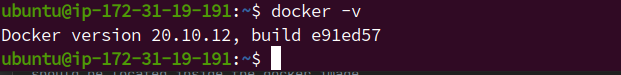
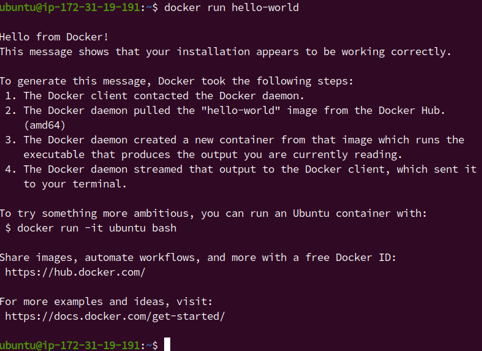
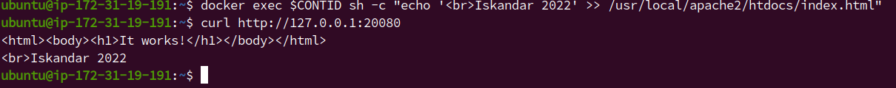
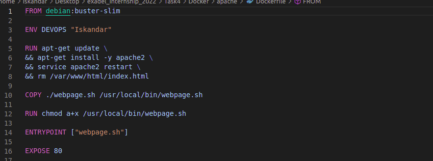
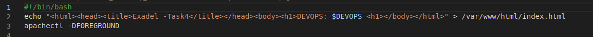
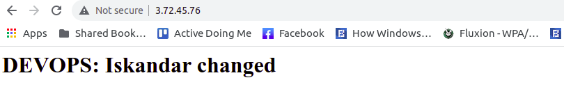
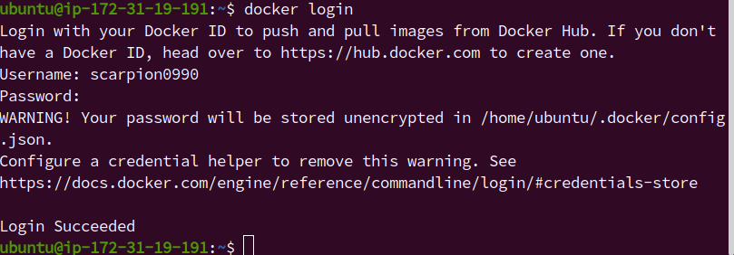
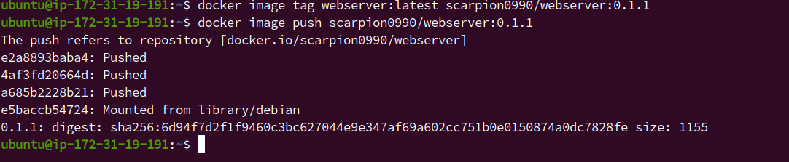
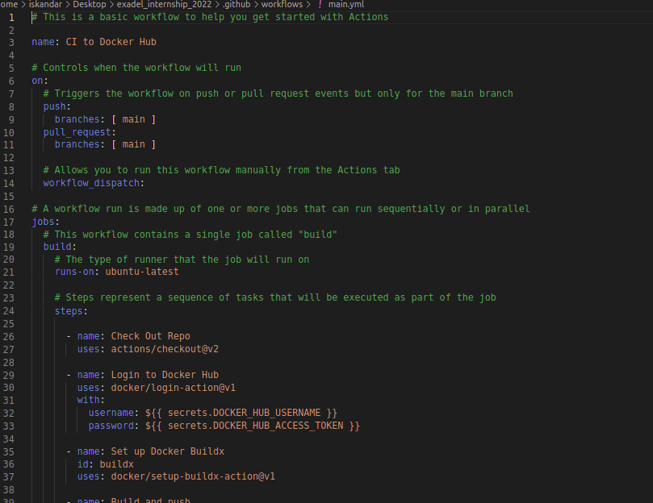
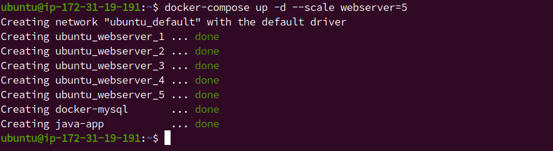

My Exadel Task 4 project (Docker)
======================================================

Docs:
------------------
1. Read documentation about docker (https://docs.docker.com/). *Answer: I have read documentation about docker*

Tasks
---------------

1. Install docker. (Hint: please use VMs or Clouds  for this.). *Answer: Using these commands to install docker is not recommended ([official reference](https://docs.docker.com/engine/install/ubuntu/)): `sudo apt install docker` `sudo apt install docker.io` See [script file](./docker.sh) taken 
   from official documentation*  
**EXTRA 1.1.** Write bash script for installing Docker. *Answer: I have written [script file](./docker.sh) for installing Docker (Using AWS and put script to User data)  *  

2. Find, download and run any docker container "hello world". (Learn commands and parameters to create/run docker containers. *Answer: After installation, I added docker to sudo group `sudo usermod -aG docker ${USER}` there is sample image hello world, I run it `docker run hello-world` *  
**EXTRA 2.1.** Use image with html page, edit html page and paste text: `<Username> 2022` *Answer: I run these commands for this: `docker run -d --name task4 -p 20080:80 httpd` and `CONTID=$(docker ps -aqf "name=task4")` then `docker exec $CONTID sh -c "echo ' Iskandar 2022' >> 
   /usr/local/apache2/htdocs/index.html"` and checking with curl `curl http://127.0.0.1:20080`*

3. 1 Create your Dockerfile for building a docker image. Your docker image should run any web application (nginx, apache, httpd). Web application should be located inside the docker image. *Answer: I created [Dockerfile](./Docker/apache/Dockerfile) with apache*  
**EXTRA 3.1.1.** For creating docker image use clear basic images (ubuntu, centos, alpine, etc.) *Answer: I used **debian:buster-slim***  
   

3. 2 Add an environment variable `DEVOPS=<username>` to your docker image. *Answer: I added `ENV DEVOPS "Iskandar"`*  
**EXTRA 3.2.1.** Print environment variable with the value on a web page (if environment variable changed after container restart - the web page must be updated with a new value). *Answer: For changing environment variable with new value I created [webpache.sh](./Docker/apache/webpage.sh)* 
*For building: `docker image build -t webserver:latest .`For running `docker run -itd -e DEVOPS="Iskandar changed" --rm -p 80:80 webserver:latest`*
   
4. Push your docker image to docker hub (https://hub.docker.com/). Create any description for your Docker image. *Answer: I already have docker hub account so, I loged in `docker login`*  
     *And I taged `docker image tag webserver:latest scarpion0990/webserver:0.1.1` and pushed `docker image tag webserver:latest scarpion0990/webserver:0.1.1`*  *My docker hub image: https://hub.docker.
   com/repository/docker/scarpion0990/webserver*    **EXTRA 4.1.** Integrate your docker image and your github 
   repository. Create an automatic deployment for each 
   push. (The Deployment can be in the “Pending” status for 10-20 
   minutes. This is normal).
*Answer: An automatic deployment only accessible for team and pro accounts and also with ci/cd actions. [Docker docs](https://docs.docker.com/ci-cd/github-actions/)*
*I have read this documentation and created two repo secrets and created main.yml(see .github directory)*  

5.  Create docker-compose file. Deploy a few docker containers via one docker-compose file.
    - first image - your docker image from the previous step. 5 nodes of the first image should be run;
    - second image - any java application;
    - last image - any database image (mysql, postgresql, mongo or etc.).  
    Second container should be run right after a successful run of a database container.
    
    *Answer: Firstly I installed [docker-compose](https://www.digitalocean.com/community/tutorials/how-to-install-and-use-docker-compose-on-ubuntu-20-04-ru), First image is my webserver image, To run 5 nodes of first image I used "--scale webserver=5" keyword (Be careful for ports), Second Java 
    application with `depends_on` to run after database*
     **EXTRA 5.1.** Use env files to configure each service. *Answer: Created `env` file for each container with key `env_file` My [docker-compose.yml](./Task4/Docker/apache/docker-compose.yml)*
    

**The task results is the docker/docker-compose files in your GitHub repository**

