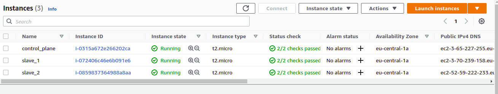
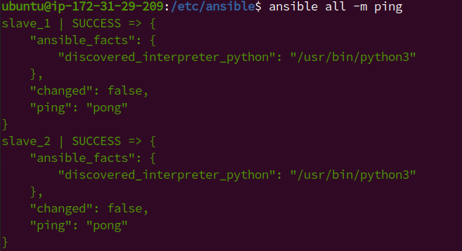
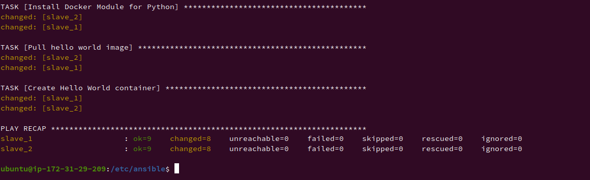
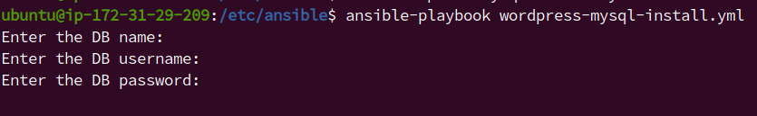
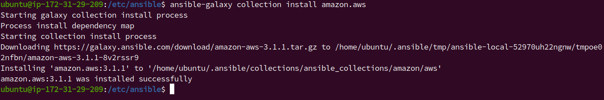
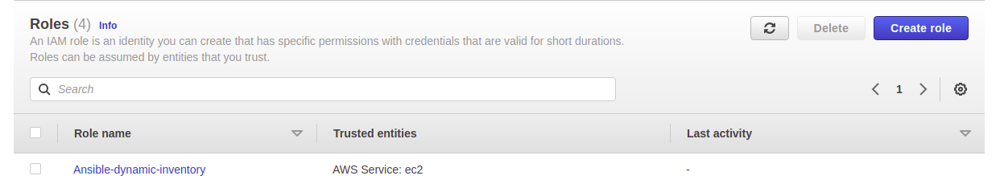
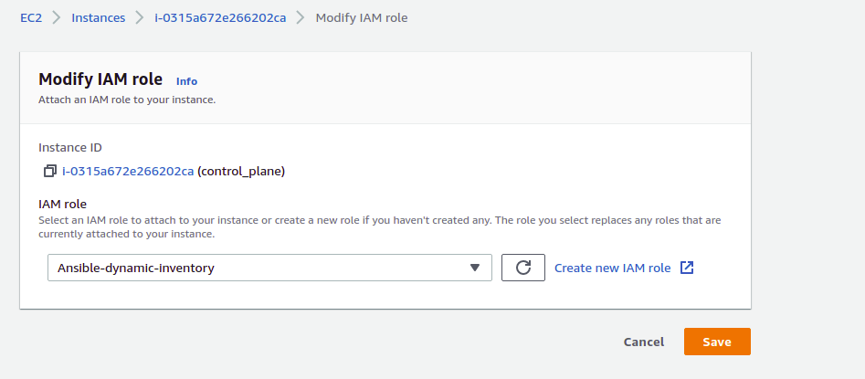
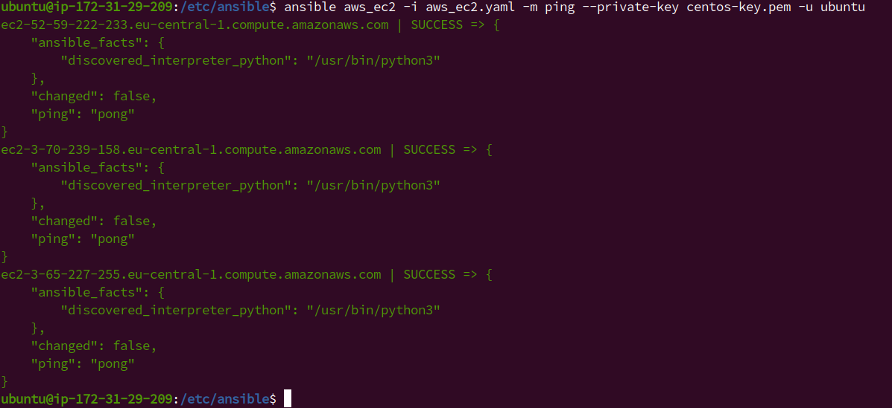

My Exadel Task 5 project (Ansible for beginners)
======================================================

Important points:
------------------
1. Read documentation about System configuration management. *Answer: I have read this [documentation](https://www.atlassian.com/continuous-delivery/principles/configuration-management).*
2. Learn about the advantages and disadvantages of Ansible over other tools. *Answer: I have learned he advantages and disadvantages of Ansible over other tools. [Reference](https://www.whizlabs.com/blog/ansible-advantages-and-disadvantages/)*
3. Become familiar with ansible basics and YAML syntax. *Answer: I have became familiar with ansible and YAML sytax*
4. Basics of working with Ansible from the official documentation. *Answer: Done*  
**EXTRA** Read the Jinja2 templating documentation. *Answer: I have read [this article](https://ttl255.com/jinja2-tutorial-part-1-introduction-and-variable-substitution/)*

Tasks
---------------

1. Deploy three virtual machines in the Cloud. Install Ansible on one of them (control_plane). *Answer: I deployed three virtual machines in the AWS and installed ansible on control_plane<br> * <br>
*Commands to install ansible*
```
   sudo apt update
   sudo apt install software-properties-common
   sudo apt-add-repository ppa:ansible/ansible
   sudo apt update
   sudo apt install ansible
```

2. Ping pong - execute the built-in ansible ping command. Ping the other two machines.
*Answer: To connect firstly, I created new SSH key pair*

```
   ssh-keygen
   cat .ssh/id_rsa.pub
```
*In the Slave VMs copied the public key and installed Python*

    nano .ssh/authorized_keys
    sudo apt update
    sudo apt install python3

*Ansible hosts file configured*

    [exadel]
    slave_1 ansible_ssh_host=172.31.24.8
    slave_2 ansible_ssh_host=172.31.31.107

*Result of ping command (ansible all -m ping)*



3. My First Playbook: write a playbook for installing Docker on two machines and run it.

*Answer: I installed Docker image on two machines (Run ansible-playbook docker-install.yml (see playbooks directory))*

```    
---
- hosts: all
  become: true

  tasks:
    - name: Install aptitude
      apt: name=aptitude state=latest update_cache=yes force_apt_get=yes

    - name: Install system packages
      apt: name={{ item }} state=latest update_cache=yes
      loop: [ 'apt-transport-https', 'ca-certificates', 'curl', 'software-properties-common', 'python3-pip', 'virtualenv', 'python3-setuptools']

    - name: Docker GPG apt Key Adding
      apt_key:
      url: https://download.docker.com/linux/ubuntu/gpg
      state: present

    - name: Adding Docker Repo
      apt_repository:
      repo: deb https://download.docker.com/linux/ubuntu bionic stable

    - name: Update apt and install docker-ce
      apt: update_cache=yes name=docker-ce state=latest

    - name: Install Docker Module for Python
      pip:
        name: docker

    - name: Pull hello world image
      docker_image:
        name: hello-world
        source: pull

    - name: Create Hello World container
      docker_container:
        name: hello-world
        image: hello-world
        state: started
        ports:
        - "80:80" 
```



**EXTRA 1.** Write a playbook for installing Docker and one of the (LAMP/LEMP stack, Wordpress, ELK, MEAN - GALAXY do not use) in Docker.  
*Answer: I have written a playbook for installing Wordpress in Docker (See playbook folder)*  

```
---
- hosts: all
  become: true
  vars_prompt:

    - name: wp_db_name
      prompt: Enter the DB name

    - name: db_user
      prompt: Enter the DB username

    - name: db_password
      prompt: Enter the DB password

  vars:
  db_host: db
  wp_name: wordpress
  docker_network: wordpress_net
  #wp_host_port: "{{ lookup('env','WORDPRESS_PORT') | default(8080)}}"
  wp_container_port: 80

  tasks:

    - name: "Create a network"
      docker_network:
      name: "{{ docker_network }}"

    - name: Pull wordpress image
      docker_image:
      name: wordpress
      source: pull

    - name: Pull MySQL image
      docker_image:
      name: mysql:5.7
      source: pull

    - name: Create DB container
      docker_container:
        name: "{{ db_host }}"
        image: mysql:5.7
        state: started
        # ports:
        #   - "3306"
        network_mode: "{{ docker_network }}"
        env:
          MYSQL_USER: "{{ db_user }}"
          MYSQL_PASSWORD: "{{ db_password }}"
          MYSQL_DATABASE: "{{ wp_db_name }}"
          MYSQL_RANDOM_ROOT_PASSWORD: '1'
        volumes:
          - db:/var/lib/mysql:rw
        restart_policy: always

    - name: Create Wordpress container
      docker_container:
        name: "{{ wp_name }}"
        image: wordpress:latest
        state: started
        ports:
        - "80:80" 
        restart_policy: always
        network_mode: "{{ docker_network }}"
        env:
          WORDPRESS_DB_HOST: "{{ db_host }}:3306"
          WORDPRESS_DB_USER: "{{ db_user }}"
          WORDPRESS_DB_PASSWORD: "{{ db_password }}"
          WORDPRESS_DB_NAME: "{{ wp_db_name }}"
        volumes:
          - wordpress:/var/www/html
```

**EXTRA 2.** Playbooks should not have default creds to databases and/or admin panel.
*Answer: I have known two methods for this first is DB credits are not included in the playbook and written it manually*



*second one is using encrypt our credits with `ansible-vault encrypt vars.yml` (Can be created ar encrypted existing file [docs](https://docs.ansible.com/ansible/latest/user_guide/vault.html)) and using encrypted variables `ansible-playbook --ask-vault-pass vars.yml` or to get from file 
`ansible-playbook --vault-password-file vars.yml` (It is for a single password).*

**EXTRA 3.** For the execution of playbooks, dynamic inventory must be used (GALAXY can be used).  
*Answer: I have read this [documentation](https://docs.ansible.com/ansible/latest/collections/amazon/aws/aws_ec2_inventory.html) for solving with dynamic inventory (Needed boto3, botocore). I installed amazon.aws.aws_ec2 plugin*

    ansible-galaxy collection install amazon.aws



*I created aws_ec2.yaml file*

```
plugin: aws_ec2
regions:
- eu-central-1
  keyed_groups:
- key: tags.group
  separator: ""
```

*Then, I created new Role in IAM -> roles (with administratorAccess)*



*Then, I attached this role to control_plane (EC2 -> actions -> Security -> Modify IAM role)*



*To test I ran command `ansible-inventory -i aws_ec2.yaml --list`*

*I checked to execute ping command to my instances `ansible aws_ec2 -i aws_ec2.yaml -m ping --private-key centos-key.pem -u ubuntu`*



*References: [devopscube.com](https://devopscube.com/setup-ansible-aws-dynamic-inventory/#:~:text=Dynamic%20inventory%20is%20an%20ansible,it%20became%20an%20Ansible%20plugin.), [clarusway.com](https://clarusway.com/ansible-working-with-dynamic-inventory-using-aws-ec2-plugin/), 
[ansible documentation](https://docs.ansible.com/ansible/latest/collections/amazon/aws/aws_ec2_inventory.html)*

**The result of this task will be ansible files in your GitHub.**
