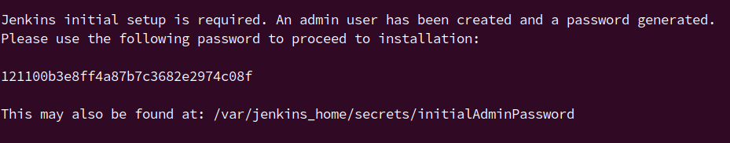
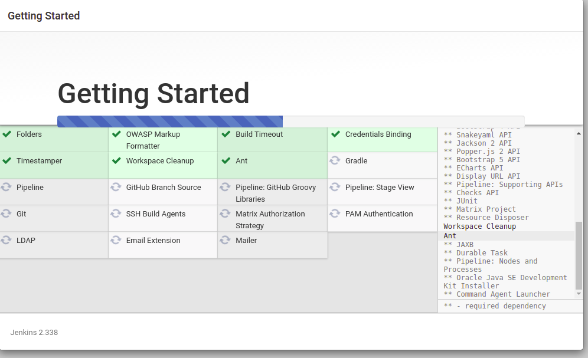
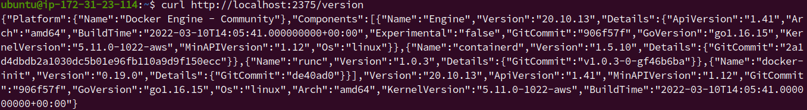
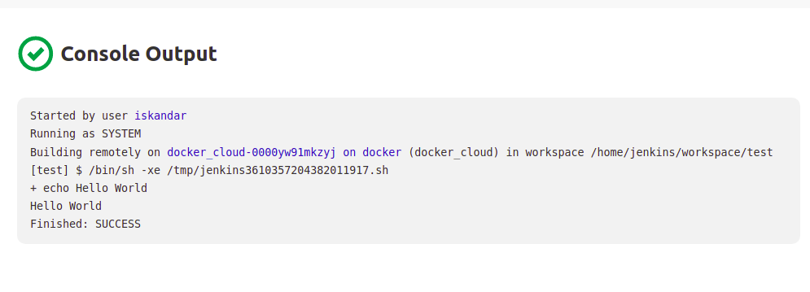
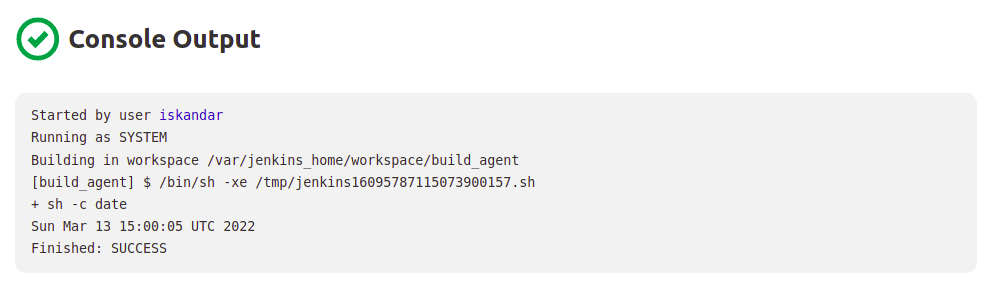
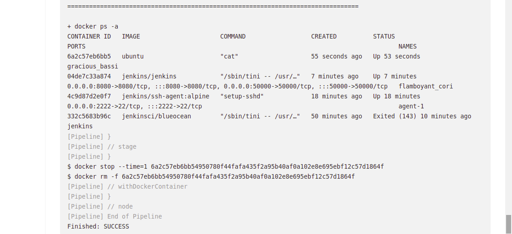

My Exadel Task 6 project (Jenkins. Automate, Manage and Control)
======================================================

Important points:
------------------
1. Read about Jenkins. What is Jenkins and what is it used for? Ways of using. What is a declarative and imperative approach? *Answer: I read documentation about Jenkins from [here](https://www.jenkins.io/doc/). What is Jenkins and what is it used for? Jenkins is a self-contained, open source automation server which can be used to automate all sorts of
   tasks related to building, testing, and delivering or deploying software. Ways of using: Pipeline, Blue Ocean, Managing Jenkins, Jenkins System Administration. What is a declarative and imperative approach? I read about
   this [here](https://www.edureka.co/community/54705/difference-between-declarative-pipeline-scripted-pipeliine)*

Tasks
---------------

1. Install Jenkins. It must be installed in a docker container. *Answer: I installed 4 instances from Ubuntu 20.04 (host_server (Jenkins), agent_server1, agent_server2, docker_cloud (I did it for Extra 1)). I also created ansible playbook which will deploy Jenkins in Docker (see Extra 2). For 
   installing 
   Jenkins in Docker use this command (There is bluacean interface, if you want it change `jenkinsci/blueocean`)*
```
   docker run -d -v jenkins_home:/var/jenkins_home -p 8080:8080 -p 50000:50000 --name jenkins jenkins/jenkins:lts
```
*I went to http://ec2-3-127-211-132.eu-central-1.compute.amazonaws.com:8080 and to unlock I had to put Administrator password. I wrote to see logs `sudo docker logs jenkins-server` and also it can be found at*

      sudo docker exec jenkins-server cat /var/jenkins_home/secrets/initialAdminPassword



2. Install necessary plugins (if you need). *Answer: When I put Administrator password Jenkins GUI asks to install suggested plugins or select plugins to install, I chose install suggested plugins (During the tasks I also needed another plugins (Docker and Password Masks))*



3. Configure several (2-3) build agents. Agents must be run in docker. *Answer: I created Credentials (Manage Jenkins -> Manage Credentials -> Add Credentials) for connecting to agents via SSH. For it I created new pair key in host_server `ssh-keygen -f ~/.ssh/jenkins_agent_key` and copied keys to another 
   hosts. I chose Kind `SSH Username with private key`, I pet ID, Description, private key and entered priavte key in hosts above cretaed. I have written two ansible playbook for installing docker to agents and docker_cloud. In docker_cloud host I changed `/lib/systemd/system/docker.service`*
```
   ExecStart=/usr/bin/dockerd -H=fd:// -H=tcp://0.0.0.0:2375 -H=unix:///var/run/docker.sock
```
*Then, I reloaded docker daemon `sudo systemctl daemon-reload` and restart docker `sudo service docker restart` and I did curl request to `curl http://localhost:2375/version` or `http://localhost:2375/images/json` with response empty json*



*For configuring Jenkins Server with docker_cloud, I installed `docker plugin` and then configured clouds for docker (adding name, docker host URI tcp://3.67.180.145:2375) and adding Docker Agent Template filling all fields (label, image, SSH Credentials) and tested it*



4. Create a Freestyle project. Which will show the current date as a result of execution. *Answer: I created new item as Freestyle project and configured it with build as execute shell, command is `sh -c date`*



5. Create Pipeline which will execute `docker ps -a` in *docker agent*, running on *Jenkins master’s Host*. *Answer: For running docker inside Jenkins master host I used this command (`sudo chmod 777 /var/run/docker.sock` for permission)*

```
   sudo docker run -p 8080:8080 -p 50000:50000 -d -v /var/run/docker.sock:/var/run/docker.sock -v jenkins_home:/var/jenkins_home jenkins/jenkins
```

*I executed docker container `docker exec -it --user root <container id> /bin/bash` and installed docker `curl https://get.docker.com/ > dockerinstall && chmod 777 dockerinstall && ./dockerinstall`*
*I created Pipeline project to run `docker ps -a`*

```
pipeline {
  agent {
    docker { 
        image 'ubuntu' 
        args '-u root:sudo'
    }
  }
  stages {
    stage('Install Docker') {
      steps {
        sh '''
           apt update -y
           apt install curl -y
           curl https://get.docker.com/ > dockerinstall && chmod 777 dockerinstall && ./dockerinstall
           docker ps -a
        '''
      }
    }
  }
}
```



6. Create Pipeline, which will build artifact using Dockerfile directly from your github repo (use Dockerfile from previous task). *Answer: *
7. Pass  variable PASSWORD=QWERTY! To the docker container. Variable must be encrypted!!!

EXTRA:
---------------

1. Create a pipeline, which will run a docker container from Dockerfile at the additional VM.
2. Create an **ansible playbook**, which will deploy Jenkins.
3. Deploy a local **docker registry**, upload a docker **image** there, download **img** from your local **docker registry** and run the **container**.
4. Configure integration between Jenkins and your Git repo. Jenkins project must be started automatically if you push or merge to master, you also must see Jenkins last build status(success/unsuccess) in your Git repo.
