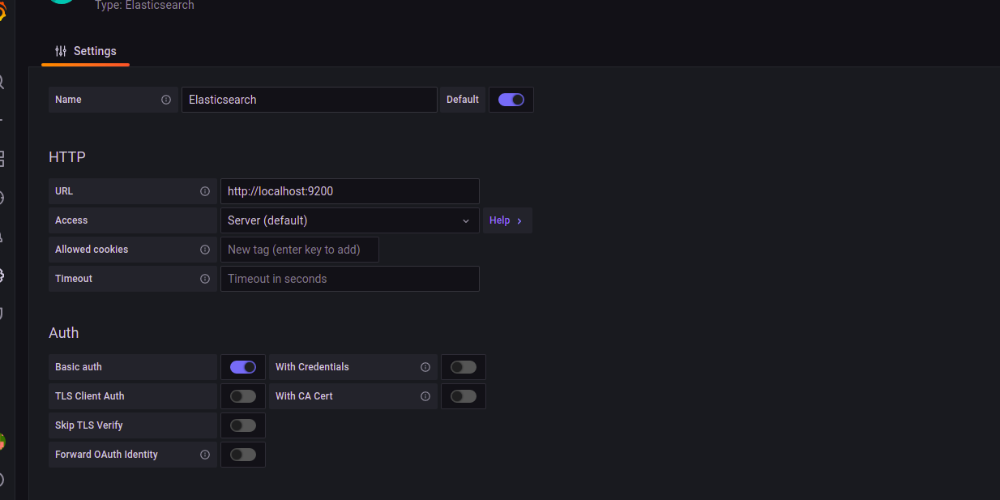

My Exadel Task 7 project (Logging & Monitoring)
======================================================

Tasks
---------------

1. Zabbix:  
   *Big brother is watching  ....*  
   1.1 Install on server, configure web and base. *Answer: I installed Zabbix with this [documantation](https://www.zabbix.com/ru/download?zabbix=6.0&os_distribution=ubuntu&os_version=20.04_focal&db=mysql&ws=apache). I needed two servers for Zabbix server and for inspecting server(agent) 
   (installing with Nginx, MySql and PHP)*   

I installed Zabbix repository
```
# wget https://repo.zabbix.com/zabbix/6.0/ubuntu/pool/main/z/zabbix-release/zabbix-release_6.0-1+ubuntu20.04_all.deb
# dpkg -i zabbix-release_6.0-1+ubuntu20.04_all.deb
# apt update
```
I installed Zabbix server, web and agent
```
# apt install zabbix-server-mysql zabbix-frontend-php zabbix-apache-conf zabbix-sql-scripts zabbix-agent
```
I created database (needed to be installed mysql-server)
```
# mysql -uroot -p
password
mysql> create database zabbix character set utf8mb4 collate utf8mb4_bin;
mysql> create user zabbix@localhost identified by 'password';
mysql> grant all privileges on zabbix.* to zabbix@localhost;
mysql> quit;
```
Then, in host Zabbix server imported initial schema and data
```
# zcat /usr/share/doc/zabbix-sql-scripts/mysql/server.sql.gz | mysql -uzabbix -p zabbix
```
I seted up DB Zabbix (/etc/zabbix/zabbix_server.conf)
```
DBPassword=password
```
Then, I started proccesses Zabbix (http://52.28.126.171/zabbix/setup.php) and configured Zabbix web (By default user: Admin. password: zabbix)
```
# systemctl restart zabbix-server zabbix-agent apache2
# systemctl enable zabbix-server zabbix-agent apache2
```

   1.2 Prepare VM or instances. *Answer: I prepared instance for installing Zabbix with ansible (See Extra 1.2.2)*  
   1.2.1 Install Zabbix agents on previously prepared servers or VM. *Answer: (See Extra 1.2.2)*  
   **EXTRA 1.2.2:** Complete 1.2.1 using **ansible** *Answer: I created playbook for installing zabbix agent (see ansible_agent folder)* I run `ansible-playbook main.yml`  
   
   1.3 Make several of your own dashboards, where to output data from your host/vm/container (one of them) *Answer: Firstly, I added new host from agent adding hostname, IP, template like Linux by Zabbit agent, zabbix server health and group like linux servers. Then, I created my own dashboard*  
   
   1.4 Active check vs passive check - use both types.*Answer: If we use zabbix agent in passive mode, it means that the poller (internal server process) connects to the agent on port 10050/TCP and polls for a certain value (e.g., host CPU load). The poller waits until the agent on the host responds with the value. Then the server gets the value back, and the connection closes.In the active mode, all data processing is performed on the agent, without the interference of pollers. However, the agent must know what metrics should be monitored, and that is why the agent connects to the trapper port 10051/TCP of the server once every two minutes (by default). The agent requests the information about the items, and then performs the monitoring on the host and pushes the data to the server via the same TCP port. [Official documentation](https://www.zabbix.com/documentation/5.4/ru/manual/appendix/items/activepassive)*  
   
   Passive check:
   
   

   Active check:
   
   

   1.5 Make an agentless check of any resource (ICMP ping) *Answer: I went to hosts and template to zabbix agent like Temlate Module ICMP Ping. And chose Monitoring -> Latest data and our ICMP Ping*  
   
   1.6 Provoke an alert - and create a Maintenance instruction *Answer: I went to configuration -> Maintenance -> Create Maintenance paeriod [tutorial](https://www.zabbix.com/documentation/3.0/en/manual/maintenance)*  
   
   1.7 Set up a dashboard with infrastructure nodes and monitoring of hosts and software installed on them *Answer: I created dashboard with infrastructure nodes and monitoring of hosts and software installed*  


2. ELK:  
   *Nobody is forgotten and nothing is forgotten.*  
   2.1 Install and configure ELK *Answer: I installed ELK reading [this tutorial](https://elk-docker.readthedocs.io/) in docker*  
   ```
   sudo docker pull sebp/elk  
   sudo sysctl -w vm.max_map_count=262144
   sudo docker run -p 5601:5601 -p 9200:9200 -p 5044:5044 -itd --name elk sebp/elk  
   ```
     
   *and second method I installed ELK with Grafana (ELK_Grafana folder)*  
   `docker-compose up -d`  
   ```
   user: elastic
   password: changeme
   ```

   2.2 Organize collection of logs from docker to ELK and receive data from running containers *Answer: I used Logspout*  
   ```
   sudo docker run -d --name="logspout" --volume=/var/run/docker.sock:/var/run/docker.sock gliderlabs/logspout syslog+tls://:5000
   ```
   *There is another way with Filebeat (see nginx-filebeat folder).*  
   ```
   cd nginx-filebeat
   docker buld . filebeat
   docker run -itd --name filebeat filebeat
   ```
   *For forwarding logs from a Docker container to the ELK container on a host, we need to connect the two containers. So, we have to create new network bridge*  
   ```
   docker network create -d bridge elknet
   docker run -p 80:80 -it --network=elknet imageName
   ```
   2.3 Customize your dashboards in ELK *Answer: *  
   **EXTRA 2.4:** Set up filters on the Logstash side (get separate docker_container and docker_image fields from the message field)  
   2.5 Configure monitoring in ELK, get metrics from your running containers  
   2.6 Study features and settings  


3. Grafana:  
   3.1 Install Grafana *Answer: I installed with ELK (see 2.1)*
   ```
   username: admin
   password: admin
   ```  
   
   3.2 Integrate with installed ELK *Answer: I integrated it with ELK, adding data source with elasticsearch*
    
   3.3 Set up Dashboards  
   3.4 Study features and settings  
